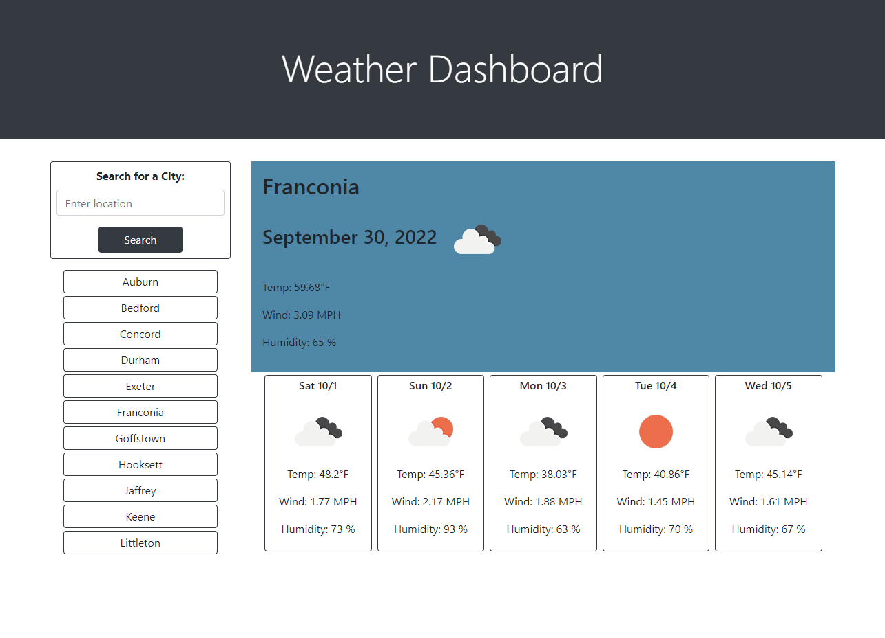

# Project 6 - Weather Dashboard
This application allows the user to search for the current weather and a five-day forecast based on searching for a city name.
* When the user searches for a city, the current weather and a five-day forecast display
* The weather presented for both the present and the future includes the date, the temperature, the wind speed, and the humidity as well as an icon that represents the current conditions
* The saved cities list allows the user to access previously searched cities

## Where to Find it
The application is deployed [here](https://pikaypi.github.io/weather-dashboard/).

## What It Looks Like

## How It Works
When the user searches for a city name, the API collects the latitude and longitude for that city and then collects the weather information for that location. If the search input field is empty, the submit does not occur.

Search results are saved to the local storage, and that local storage is used to populate the list of cities that have already been searched. Cities that have already been searched are never added more than once to the local storage. A future feature will be a delete button for saved cities.